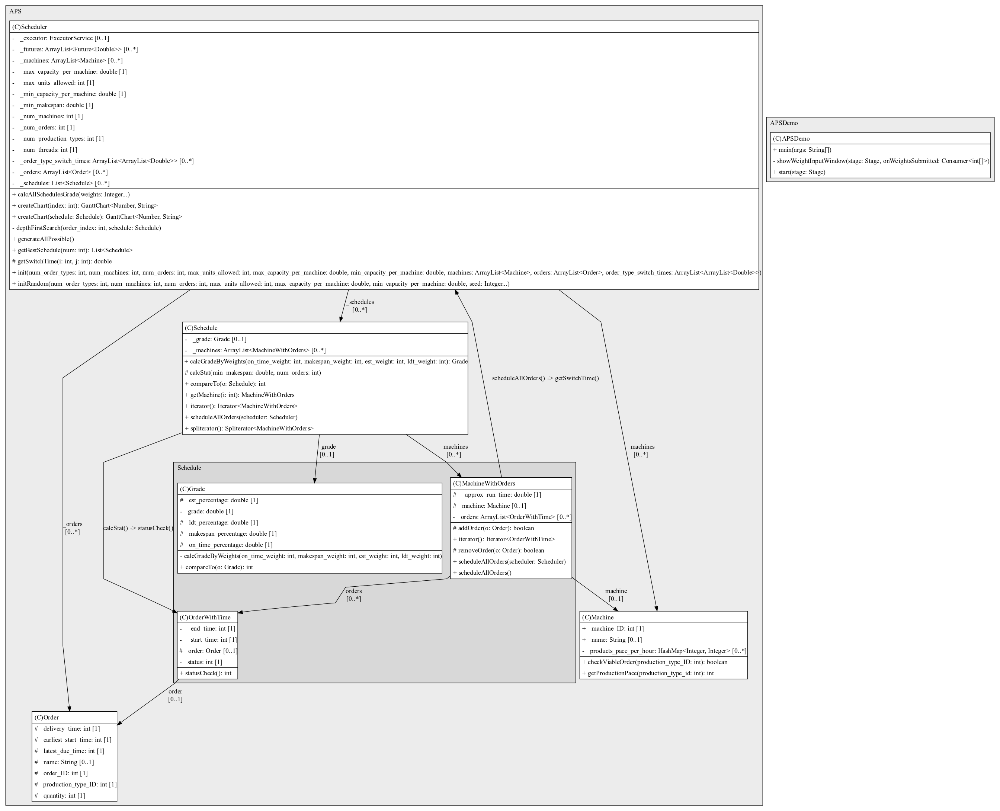
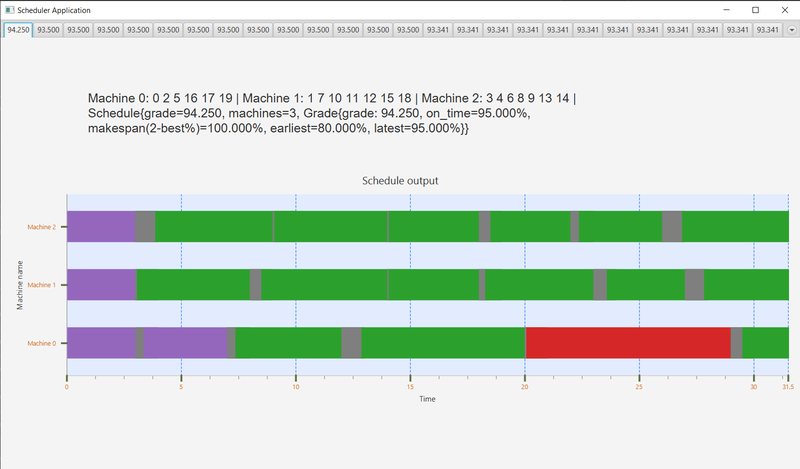
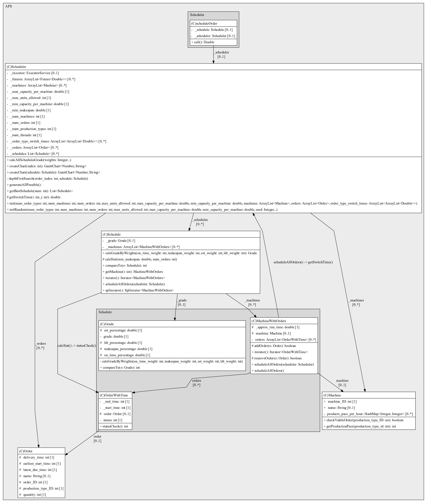
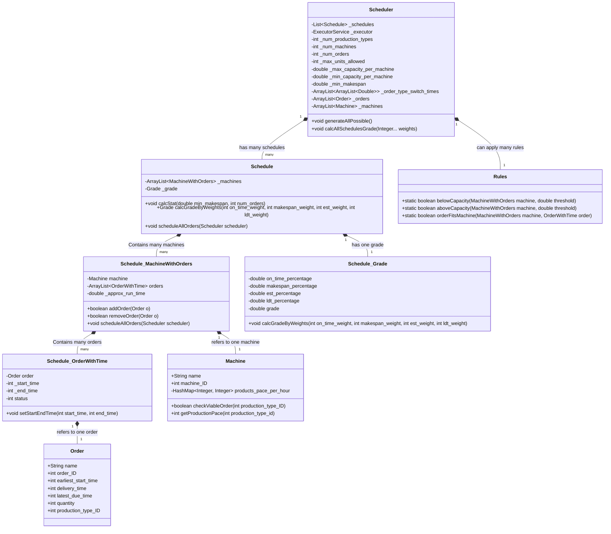
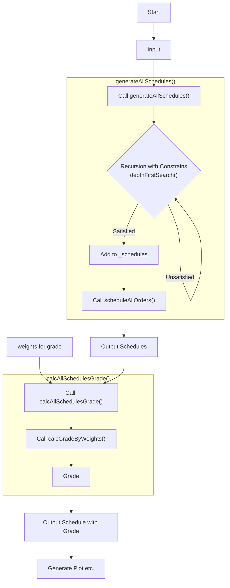

# Advanced Planning and Scheduling(APS) Application

[](https://rpifisherman.github.io/APS-app/javadocs/index.html)
[](https://rpifisherman.github.io/APS-app/javadocs/ygong/APS/package-summary.html)
[](README_CN.md)

```text
         _                   _          _                 _                   _          _
        / /\                /\ \       / /\              / /\                /\ \       /\ \
       / /  \              /  \ \     / /  \            / /  \              /  \ \     /  \ \
      / / /\ \            / /\ \ \   / / /\ \__        / / /\ \            / /\ \ \   / /\ \ \
     / / /\ \ \          / / /\ \_\ / / /\ \___\      / / /\ \ \          / / /\ \_\ / / /\ \_\
    / / /  \ \ \        / / /_/ / / \ \ \ \/___/     / / /  \ \ \        / / /_/ / // / /_/ / /
   / / /___/ /\ \      / / /__\/ /   \ \ \          / / /___/ /\ \      / / /__\/ // / /__\/ /
  / / /_____/ /\ \    / / /_____/_    \ \ \        / / /_____/ /\ \    / / /_____// / /_____/
 / /_________/\ \ \  / / /      /_/\__/ / /       / /_________/\ \ \  / / /      / / /
/ / /_       __\ \_\/ / /       \ \/___/ /       / / /_       __\ \_\/ / /      / / /
\_\___\     /____/_/\/_/         \_____\/        \_\___\     /____/_/\/_/       \/_/
                                                                 
```

## Introduction

Extend from the [APS-MES](https://github.com/RPIFisherman/APS-MES). This project
add a graphical user interface (GUI) to the APS application. The GUI is
implemented using the [javafx](https://openjfx.io/) library.

[](https://github.com/RPIFisherman/APS-app/actions/workflows/qodana_code_quality.yml)
[](https://github.com/RPIFisherman/APS-app/actions/workflows/auto_sync.yml)
[](https://codecov.io/gh/RPIFisherman/APS-app)

Thanks
to [Roland's Gantt Plot code](https://stackoverflow.com/questions/27975898/gantt-chart-from-scratch),
which helps me a lot on JavaFX.

## Requirements

- Java 21 is recommended, other version may not work.
    - Java 8 can compile and run [APSDemo.java](src/main/java/APSDemo.java) but
      may not pass the test.
- Maven 3.9.6 is recommended, other version may not work.

## APSDemo:



## APSDemo Output:



## Project Structure:



### Concise Diagram:


## Project Workflow:


