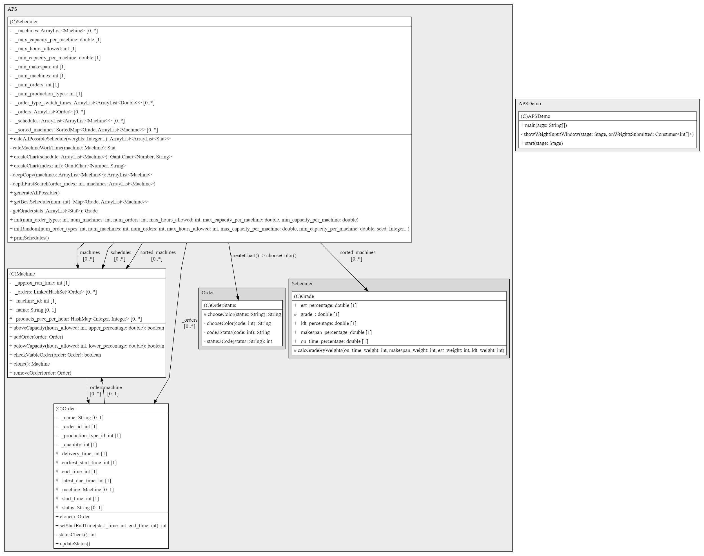

#Advanced Planning and Scheduling(APS) Application

## Introduction

Extend from the [APS-MES](https://github.com/RPIFisherman/APS-MES). This project
add a graphical user interface (GUI) to the APS application. The GUI is
implemented using the [javafx](https://openjfx.io/) library.

## Project Structure:
