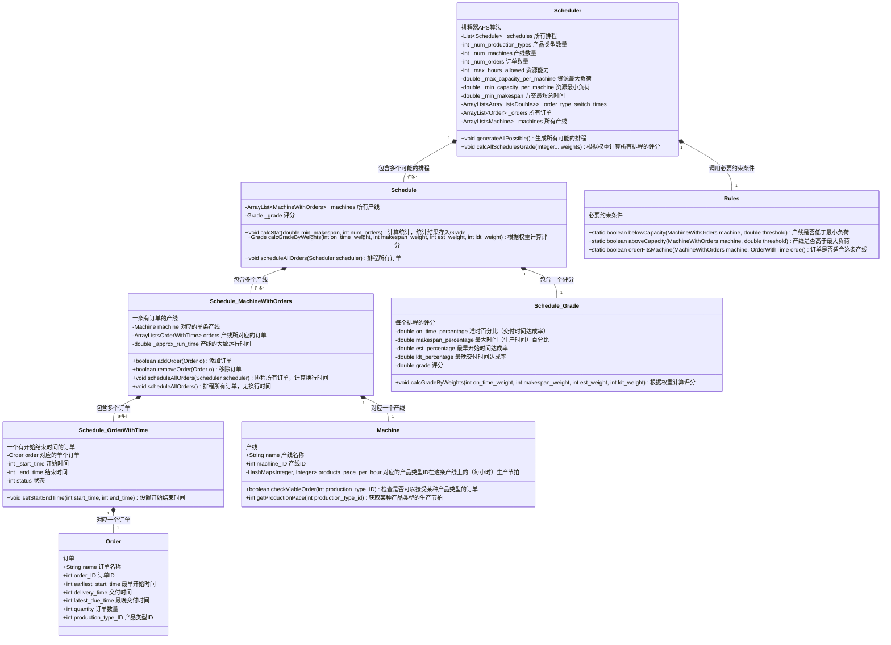
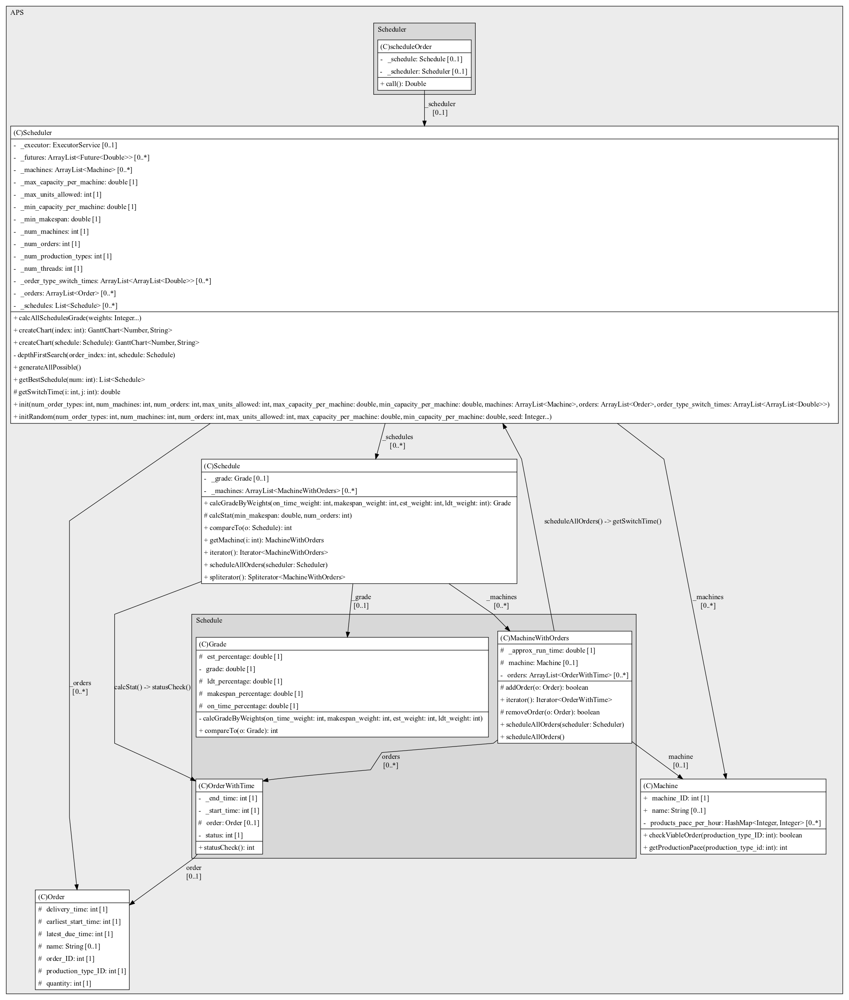

# APS 排程

[](https://rpifisherman.github.io/APS-app/javadocs/index.html)
[](https://rpifisherman.github.io/APS-app/javadocs/ygong/APS/package-summary.html)
[](README.md)

```text
         _                   _          _                 _                   _          _
        / /\                /\ \       / /\              / /\                /\ \       /\ \
       / /  \              /  \ \     / /  \            / /  \              /  \ \     /  \ \
      / / /\ \            / /\ \ \   / / /\ \__        / / /\ \            / /\ \ \   / /\ \ \
     / / /\ \ \          / / /\ \_\ / / /\ \___\      / / /\ \ \          / / /\ \_\ / / /\ \_\
    / / /  \ \ \        / / /_/ / / \ \ \ \/___/     / / /  \ \ \        / / /_/ / // / /_/ / /
   / / /___/ /\ \      / / /__\/ /   \ \ \          / / /___/ /\ \      / / /__\/ // / /__\/ /
  / / /_____/ /\ \    / / /_____/_    \ \ \        / / /_____/ /\ \    / / /_____// / /_____/
 / /_________/\ \ \  / / /      /_/\__/ / /       / /_________/\ \ \  / / /      / / /
/ / /_       __\ \_\/ / /       \ \/___/ /       / / /_       __\ \_\/ / /      / / /
\_\___\     /____/_/\/_/         \_____\/        \_\___\     /____/_/\/_/       \/_/

```

[](https://github.com/RPIFisherman/APS-app/actions/workflows/qodana_code_quality.yml)
[](https://github.com/RPIFisherman/APS-app/actions/workflows/auto_sync.yml)
[](https://codecov.io/gh/RPIFisherman/APS-app)

## 版本需求

- 建议使用 Java 21，其他版本可能无法工作。
    - Java 8 可以编译并运行 [APSDemo.java](src/main/java/APSDemo.java)，但
      可能无法通过测试。
- 建议使用 Maven 3.9.6，其他版本可能无法工作。

## APSDemo 输出:


## 项目结构：

### 简明图表：

[](https://www.mermaidchart.com/raw/eac1bfb2-a39f-4aeb-a1f3-b894f8abc53f?theme=light&version=v0.1&format=svg)



### 详细图表：




## APS 排程算法流程图：


